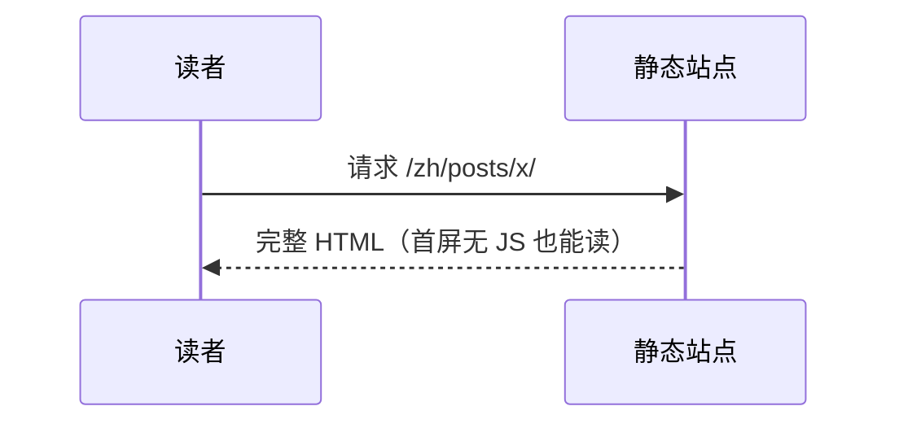
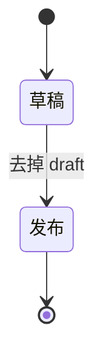
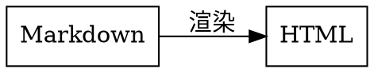
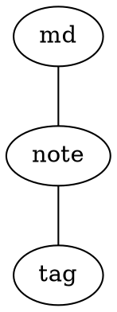

# 博客写作规范

这份文件回答一件事：**在这个博客里，一篇文章该怎么写。**

它放在仓库根目录（与 [README.md](./README.md)、[PROJECTS.md](./PROJECTS.md) 并列），**不是文章**，
不参与构建。文章一律写在 `content/<lang>/posts/` 下；那边的字段速查表在
[content/README.md](./content/README.md)，本文比它更全、更适合从头读一遍。

> 本文与代码一一对应。改行为请同步改本文，别让文档骗人。涉及的关键文件：
> `lib/content.ts`（读文件、slug、字数）、`lib/markdown.ts`（渲染管线）、
> `lib/typography.ts`（中文排版）、`lib/charts.ts`（图表语言名）、`lib/frontmatter.ts`（字段归一化）、
> `components/ArticleBody.tsx` 与 `components/charts/*.ts`（五类图表怎么画）。

**篇幅较长，按需查：** 只想知道「某个语法怎么写」直接看第 1 节速查表和第 6 节；
要写图表看第 8 节，要写公式看第 9 节。

---

## 0. 三条铁律

1. **仓库里不放文章。** `content/**/posts/` 只保留规范与空目录结构，`README.md` 与下划线开头的
   文件都被加载器显式跳过。不写测试文章、不写示例文章 —— 第一篇由你亲笔写。
2. **URL 只能是 ASCII。** 文件名可以是中文，但上线地址（slug）只能是 `[A-Za-z0-9._~/-]`。
   文件名是中文时必须自己补一行 `slug`，否则构建**直接失败**（原因见第 2 节）。
3. **配色与实现不归文章管。** 文章只管文字与 Markdown；版式、颜色、交互都在代码里
   （颜色只有 `app/globals.css` 三套令牌一个落点）。文章里要用的「花样」只有本文列出的这些。

---

## 1. 速查表（一页对照）

| 想写什么 | 怎么写 | 细节在 |
| --- | --- | --- |
| 文章元信息 | 文件开头的 `---`（YAML）或 `+++`（TOML）块 | 第 3、4 节 |
| 一篇文章 | `content/<lang>/posts/<ascii-slug>.md` | 第 2 节 |
| 分组 / 卡组 | 放到子目录里，配一个 `_index.md` | 第 5 节 |
| 标题 | `## 二级` … `###### 六级`（正文**不要用 `#`**） | 第 6 节 |
| 加粗 / 斜体 | `**粗**` / `*斜*` | 第 6 节 |
| 行内代码 | 反引号包起来：`` `code` `` | 第 6 节 |
| 代码块 | 三个反引号 + **语言名** | 第 7 节 |
| 表格 | GFM 竖线表格 | 第 6 节 |
| 任务列表 | `- [ ] 待办` / `- [x] 已办` | 第 6 节 |
| 脚注 | `文字[^1]` + 文末 `[^1]: 说明` | 第 6 节 |
| 删除线 | `~~删除~~`（单个 `~` 也认） | 第 6 节 |
| 引用块 | `> 引用` | 第 6 节 |
| 链接 | `[文字](https://…)`；裸写 `https://…` 也会自动成链；行内自动加站点图标，单独一行自动变卡片 | 第 6 节 |
| 图片 | `` | 第 12 节 |
| 分隔线 | 单独一行 `---` | 第 6 节 |
| 流程图 / 时序图 | ` ```mermaid ` 代码块 | 第 8 节 |
| 数据图表 | ` ```echarts ` + 一份 option 的 **JSON** | 第 8 节 |
| 节点图 | ` ```dot ` / ` ```graphviz ` | 第 8 节 |
| 五线谱 | ` ```abc ` | 第 8 节 |
| 化学结构式 | ` ```smiles ` + SMILES 表达式 | 第 8 节 |
| 公式（行内） | `$E=mc^2$` | 第 9 节 |
| 公式（独立成行） | `$$ … $$` | 第 9 节 |
| 参考文献 | frontmatter 写 `references`，正文写 `[reference:1]` | 第 10 节 |
| 中英文之间的空格 / 标点全角 | **不用管，自动排** | 第 11 节 |
| 封面 | `cover`，不写也行（纯文字站很常见） | 第 12 节 |

**图表只有五个语言名**（`mermaid` / `echarts` / `graphviz`·`dot` / `abc`·`abcjs` / `smiles`）。
本仓库**没有**短代码机制，也没有别的插件语法 —— 别的生成器里那种
``（Hugo / VuePress 的短代码）在这里**不会被识别**，写成代码块语言名写错
（如 ` ```chem `）也不会画任何东西，只会当普通文本 / 普通代码（见第 8 节末尾）。

---

## 2. 目录、文件与地址

```
content/
├─ README.md                     ← 字段速查，不参与构建
├─ zh/
│  └─ posts/
│     ├─ README.md               ← 中文写作提示，不参与构建
│     ├─ _index.md               ← 可选：中文帖子的顶层卡组元数据
│     ├─ hello-world.md          → /zh/posts/hello-world/
│     ├─ notes/                  ← 目录即分组（卡组）
│     │  ├─ _index.md            ← 该卡组的标题 / 描述 / 顺序 / 封面
│     │  └─ first-note.md        → /zh/posts/notes/first-note/
│     └─ notes/index.md          → /zh/posts/notes/（目录首页，可选）
└─ en/
   └─ posts/…                    ← 同上，英文
```

规则：

| 事项 | 约定 |
| --- | --- |
| 只认的后缀 | `.md`、`.markdown` |
| slug 怎么来 | 由文件路径推导：`notes/first-note.md` → `notes/first-note` |
| `目录/index.md` | 代表这个目录本身，slug 就是目录名（`notes/index.md` → `notes`） |
| 自定义 slug | frontmatter 里写 `slug`（别名 `permalink`），**只能 ASCII** |
| 跳过的文件 | 名字叫 `README.md` 的；下划线开头的（`_index.md` 是唯一的例外，它是卡组元数据） |
| slug 冲突 | 两个文件推出同一个 slug → **直接报错**，不会悄悄覆盖 |
| 零文章 | 正常状态，站点照样能构建、能浏览（各页有空状态） |

**为什么 ASCII 是硬要求（真踩过的坑）**：浏览器会把 `href` 里的中文自动百分号编码，
而静态导出会把中文 slug 写成百分号编码的目录名，Cloudflare 查文件前又解码一次 ——
两边永远对不上。表现是「列表里有卡片，点标题进去 404」。所以加载器直接拦住非 ASCII：

```
content/zh/posts/notes/笔记.md：slug "笔记" 里有 URL 不安全的字符（中文、空格、% 等）。
… 把文件重命名为 ASCII（例如 note-1.md），或在 frontmatter 里补一行 slug = "note-1"（YAML: slug: note-1）。
```

**两种解法**（任选）：

```markdown
---
title: 笔记
slug: note-1        # ← 保留中文文件名，只补这一行
date: 2026-10-01
---
```

或直接把文件重命名成 `note-1.md`。

**中英文两版**：同一篇文章想有中英两版，就分别在 `content/zh/posts/` 与 `content/en/posts/`
下用**同一个 slug**，站点会自动认成一对（跨语言配对，用于 hreflang / canonical）。

---

## 3. 一篇最小文章

````markdown
---
title: 你好，世界
date: 2026-01-01
tags: [随笔]
---

正文从这里开始。

## 小节标题

一段话。
````

frontmatter 是**文件开头的元数据块**：第一行写 `---` 就用 YAML，写 `+++` 就用 TOML，
两者**完全等价**，挑顺手的一种，同一个文件里不要混用。

### YAML（`---`）

```yaml
---
title: 用 YAML 写的文章
date: 2026-01-01 09:30:00
updated: 2026-01-03
description: 一句话摘要，会用在列表、SEO、RSS 里。
tags: [写作, 折腾]
categories: [随笔]
cover: /thumbnails/zh/yaml-post.png
pinned: false
draft: false
isAI: false
slug: yaml-post          # 文件名是中文时才必须
references:
  - id: 1
    title: 一篇参考资料
    url: https://example.com/paper
    author: 张三
---
```

### TOML（`+++`）

```toml
+++
title = "用 TOML 写的文章"
date = 2026-01-01T09:30:00
updated = 2026-01-03
description = "一句话摘要，会用在列表、SEO、RSS 里。"
tags = ["写作", "折腾"]
categories = ["随笔"]
cover = "/thumbnails/zh/toml-post.png"
pinned = false
draft = false
isAI = false
slug = "toml-post"

[[references]]
id = 1
title = "一篇参考资料"
url = "https://example.com/paper"
author = "张三"
+++
```

> `date` 不写引号时：TOML 按日期时间解析、YAML 按时间对象解析，本仓库统一归一化成字符串，
> 两种写法最终语义一致，不必纠结。**字符串值一定要加引号**，忘了会报
> `无法解析的值 "…"（字符串请加引号）`。

---

## 4. frontmatter 字段全集

用不到的字段直接省略。**建议只写 `title` / `date` / `description` / `tags` 这四样起手**。

| 字段 | 类型 | 说明 |
| --- | --- | --- |
| `title` | 字符串 | **建议必写**。缺省时依次回退到正文第一个 `#` 标题、文件名。 |
| `date` | 日期 | 发布日期。缺省回退到**文件修改时间**，建议显式写。 |
| `updated` | 日期 | 最后更新日期，文章页会显示「改于 …」。 |
| `description` | 字符串 | 摘要，用于列表 / SEO / RSS。缺省时从正文自动截取约 **160 字**。 |
| `tags` | 数组或字符串 | `[a, b]` 或 `"a, b"`（逗号、顿号、分号、竖线都能分隔），自动去重。 |
| `categories` | 数组或字符串 | 同上。 |
| `cover` | 字符串 | 缩略图，见第 12 节。纯文字站可以完全不写。 |
| `pinned` | 布尔 | 置顶，首页列表排在前面（不影响卡组内顺序）。 |
| `draft` | 布尔 | 草稿。**生产构建里不出现**，`npm run dev` 下能看到并带草稿徽章。 |
| `about` | 布尔 | 标记为「关于」类文章；每种语言取时间最新的一篇，显示在 `/zh/about/`。 |
| `hiddenInHomeList` | 布尔 | 首页列表里不出现，但归档 / 标签 / 搜索里仍然有。 |
| `isAI` | 布尔 | AI 生成标记（带 `ai` 徽章，列表页默认可筛掉）。 |
| `comments` | 布尔 | 这一篇要不要评论区，缺省 `true`。写 `false` 就整篇不出评论区。 |
| `references` | 表数组 / 数组 | 参考文献，见第 10 节。 |
| `slug` / `permalink` | 字符串 | 自定义路由，**只能 ASCII**。 |
| `typography` | 布尔 / 对象 | 中文排版开关，见第 11 节。 |
| `order` / `weight` / `index` | 数字 | **只在 `_index.md` 里用**：卡组排序，小的在前。 |

### 别名与容错

以下写法都能识别，**选一种统一用**即可：

- 布尔值：`true` / `"true"` / `1` / `"是"` / `"开"`（反面：`false` / `"false"` / `0` / `"否"` / `"关"`）；
- 字段别名：
  `name`↔`title`、`created`/`published`↔`date`、`modified`↔`updated`、`summary`↔`description`、
  `cates`↔`categories`、`top`/`sticky`/`featured`↔`pinned`、
  `hidden`/`excludeFromHome`↔`hiddenInHomeList`、`ai`↔`isAI`、`comment`↔`comments`、
  `thumbnail`/`image`/`banner`↔`cover`、`permalink`↔`slug`。

### 日期口径

| 写法 | 解释 |
| --- | --- |
| `2026-01-01T09:30:00Z` / `+08:00` | 带时区，按绝对时间 |
| `2026-01-01T09:30:00` / `2026-01-01 09:30` | 不带时区，按**构建机器的本地时间** |
| `2026-01-01` | 只有日期，视为当天 `00:00:00Z`（跨时区最稳） |

只写日期最省心；要精确到分钟且在意跨时区，就带上时区。

### 字数与阅读时长怎么算

- 中、日、韩文按**字**计，西文按**词**计（`wordCount`）；
- 阅读时长 = 字数 ÷ **400 字/分钟**，向上取整，显示在文章页头。

---

## 5. 卡组：目录即分组

一个目录就是一个**卡组**。列表页按卡组分块显示（组头 + 篇数 + 组内卡片），
每个卡组还**自带一个页面**：`content/zh/posts/notes/` → `/zh/posts/notes/`，
不需要你写任何文件。

想让卡组有名字 / 说明 / 封面 / 排序，就在目录里放一个 `_index.md`：

```toml
+++
title = "折腾笔记"
description = "环境配置、踩坑记录之类。"
order = 10
cover = "/thumbnails/zh/notes.png"
+++
```

- `order` 小的排前面（`weight`、`index` 是别名），不写按 0 处理；
- `cover` 缺省时，卡组封面取组内第一篇文章的封面；
- 没有 `_index.md` 的目录只要有文章，照样被当成卡组，标题由 UI 用目录名兜底；
- 组内文章按**时间倒序**，`pinned` 不影响组内顺序；
- 目录里一篇文章都没有时，卡组页不存在（空目录不出现）。

两种**不做**卡组页的情形（「谁更具体谁优先」）：

1. 目录里写了 `index.md`（如 `notes/index.md` → slug `notes`）—— 那个地址就是你那篇文章，正文优先；
2. 顶层直接放的文章（`content/zh/posts/*.md`）不是卡组，在列表页里归「未分组」。

---

## 6. 正文语法全集（Markdown）

渲染管线是 `remark-parse` → GFM → 中文修正 → `remark-math` → 中文排版 → 角标 →
`rehype-raw` → `rehype-slug` → KaTeX → `rehype-highlight` → HTML，
构建期一次性跑完，静态导出后**没有 JS 也能读**。

> 渲染配置（`lib/markdown.ts`）：GFM 开启（`singleTilde: true`）、
> `remark-breaks` 开启、行内 HTML 允许、代码高亮 `detect: false`（不猜语言）。

### 6.1 标题

```markdown
## 二级标题
### 三级标题
#### 四级标题
```

- **正文从 `##` 起**：文章页页头那个大标题（`<h1>`）来自 frontmatter 的 `title`，
  正文里再写一个 `#` 会多出一个 h1，也会进目录；
- 标题**自动加 id** 并在末尾追加一个 `#` 锚点（悬停可见，可复制链接）；
- 页内跳转可以直接写 `[跳到那节](#小节标题)`（id 大致等于标题文字，空格变 `-`）；
- 目录只列到 `####`（见第 13 节），更深的标题照常渲染、只是不进目录。

### 6.2 强调与行内代码

```markdown
*斜体* 、 **粗体** 、 ***粗斜体***
~~删除线~~（单个 ~ 也认：~删除~）
行内代码用反引号：`npm run dev`
代码里要出现反引号就用双反引号包：``a `b` c``
```

**中文里紧贴标点的强调 / 删除线可以放心写**（`**抗生素（antibiotic）**的定义`、`~~（已废弃）~~`）——
管线里有 `remark-cjk-friendly` 系列插件专门修这个 CommonMark 的老毛病。
唯一的例外是**跨节点相邻**（如 `**中文**English`），插件看不出来，自己补一个空格。

### 6.3 换行与分段

`remark-breaks` 已开启 —— **敲一个回车就换行**，不必在行尾留两个空格：

```markdown
第一行
第二行        ← 渲染出来就是两行

空一行才是新段落（段落之间会有更大间距）
```

### 6.4 列表

```markdown
- 无序项
- 无序项
  - 缩进两格就是子项

1. 有序项
2. 有序项

- [ ] 还没做
- [x] 已经做
```

- **有序列表的标记后面必须有空格**：`1. 世界边界检查` 是一个列表项；
  `1.世界边界检查` 只是以「1.」开头的普通段落 —— 这是 Markdown 语法本身的要求（GitHub 上也一样），
  编号后面紧跟中文时最容易漏。**排版优化不会替你补这个空格。**
- 任务列表渲染成不可点的复选框（静态站没有写入的后端，勾选状态就是文本本身）。
- 列表项里可以放多段、代码块、引用 —— 后续行缩进对齐即可。

### 6.5 引用块

```markdown
> 一级引用
>
> 第二段（空行前面加 `>`）
>
> > 嵌套引用
```

### 6.6 链接

```markdown
[站内](/zh/about/)                ← 站内用根路径，结尾带 /
[站外](https://example.com/)      ← 站外自动 target=_blank + rel=noopener
[带标题的链接](https://example.com/ "鼠标悬停的说明")

裸链接也会自动成链：https://example.com/
```

链接**文字**会被中文排版处理，**地址**不会（第 11 节）。

链接还**自动补两样东西**（`lib/link-cards.ts`，作者不用加任何标记）：

- 前后还有别的字的**行内链接**：链接文字前加一枚与正文字号同大的站点图标（按域名向图标
  服务取，取不到就留一块空位；**不会**撑大上下行距）。站内链接、标题里的链接、脚注角标不加；
- **单独一行**（整个段落只有这一条链接）的**站外**链接：变成一张整张可点的卡片。
  指向 `github.com/<用户名>` 个人主页的会顺带问一次 GitHub 公共接口，补上头像 / 名称 / 简介；
  其它站外链接是「图标 + 标题 + 域名」的通用卡片，**不抓视频封面**。

想让链接老老实实留在行内、不做卡片，就别让它独占一个段落（紧跟一行说明文字即可，
如示例里那样）；卡片只在「整段只有这条链接」时才出现。

### 6.7 表格（GFM）

```markdown
| 语言名 | 渲染成 | 备注 |
| --- | :---: | ---: |
| `mermaid` | 流程图 | 可写注释 |
| `echarts` | 图表 | JSON，不能写注释 |
```

- 第二行的 `---` 分隔行必须有（决定表头）；
- 用 `:---`（左对齐，默认）、`:---:`（居中）、`---:`（右对齐）；
- 单元格里的 `|` 要写成 `\|`；
- 表格会横向滚动，手机上不会挤坏版面。

### 6.8 脚注（GFM）

```markdown
注意力机制[^1]的关键是……

[^1]: Vaswani et al., *Attention Is All You Need*, 2017.
```

- 定义可以写在正文任意位置，渲染时**统一收在正文末尾**（在文末「参考文献」之前）；
- 脚注里的内容也支持链接、代码等行内语法。

### 6.9 分隔线

```markdown
---
```

单独一行 `---` 是水平分隔线。**注意别和 frontmatter 的 `---` 混淆**：
只有**文件第一行**的 `---` 才是元数据块的开头。

### 6.10 转义

Markdown 的特殊字符前加反斜杠即可原样显示：

```markdown
\* 不是斜体
\$5 不是公式（金额一定要转义，否则会被当成公式开始）
\_ \# \[\]
```

### 6.11 内联 HTML（允许）

正文里可以直接写 HTML，构建期照原样输出：

```html
<span style="color: var(--c-accent)">用站点令牌染色的一段话</span>

<details>
  <summary>点开看细节</summary>

  折叠内容（里面也能写 Markdown，注意空行）

</details>

<!-- 注释写在这里不会显示 -->
```

- 内联 HTML 里的内容**不参与中文排版优化**，也不会被自动加空格；
- 颜色请用站点令牌 `var(--c-*)`，不要写死 `#000` / `#fff`（暗色外观下会看不见）；
- 图表、公式、角标这些仍然走各自的语法，不要试图用 HTML 手搓。

### 6.12 写作习惯建议

- 一篇只用一个 `##` 级别做骨架，小节之间别跳级（`##` 直接到 `####` 会让目录缩进看起来怪）；
- 段落别太长，一段说一件事；中文随笔用「单换行」分段读起来更轻；
- 标题里不要手写编号（`## 1. 引言` 可以，但别在标题里再写 `#`）；
- 想让某句成为摘要候选，就把它写进 frontmatter 的 `description`，别依赖自动截取。

---

## 7. 代码块与代码高亮

围栏代码块 = 三个反引号开头、三个反引号结尾，**紧跟语言名**（语言名后可跟标题，见第 8 节）：

````markdown
```ts
export function add(a: number, b: number): number {
  return a + b;
}
```
````

- **要写语言名才会高亮**：渲染器是 `detect: false`，**不做自动语言猜测**；
  不写语言名 = 一段没有配色的等宽文本；
- 每个代码块顶上有**一条工具头**：左边印你写的语言名（` ```java ` 就印 `java`，
  不认得的语言名照样印出来，只是不配色），右边一颗**复制**按钮
  （语言名在构建期就印好，禁用 JS 也看得到；复制按钮要等浏览器把脚本跑起来才有）；
- 高亮主题是 **monokai**（与三套外观共用一套配色，代码块自带底色）；
  **代码块在浅色外观下也是深底**，这是有意的，不做反向主题 —— 三套外观下都是同一块深色代码；
- 语言名认不出来**不会报错**（`ignoreMissing: true`），只是不高亮、当普通代码——
  所以「我把 ` ```chem ` 写成了代码块，为什么什么都没画」的答案就是：**图表只认那五个语言名**（第 8 节）；
- 常用语言名：`ts` `tsx` `js` `jsx` `json` `bash` `shell` `python` `go` `rust` `java` `sql`
  `css` `html` `xml` `yaml` `toml` `ini` `diff` `markdown` `text`；
- 想标注语言又不想高亮（或想用别的语言名当标签）：用 `text` / `plaintext`；
- 代码块里**不能**再放三个反引号 —— 要嵌套就用更多反引号（四个）包外层，或外层改用 `~~~`：

````markdown
~~~~markdown
```ts
const x = 1;
```
~~~~
````

---

## 8. 五类图表（完整示例，可照抄）

约定：**用代码块的语言名**决定画什么。标题写在语言名后面 `title="…"`，
会渲染成图注（在图的下方）。也可以完全不写标题。

| 语言名 | 渲染成 | 能写注释吗 |
| --- | --- | --- |
| `mermaid` | Mermaid：流程图 / 时序图 / 状态图 / 类图 / 甘特图 / 饼图 | 能（`%%`） |
| `echarts` | ECharts 图表，内容是**一份 option 的 JSON** | **不能**（JSON 不支持注释） |
| `graphviz` / `dot` | Graphviz：有向图 / 无向图 | 能（`//`、`/* */`、`#`） |
| `abc` / `abcjs` | 五线谱（ABC notation） | 能（`%`） |
| `smiles` | 化学结构式（SmilesDrawer） | 只取第一行表达式，`#` 开头的行忽略 |

### 8.1 Mermaid

````markdown
```mermaid title="构建流程"
flowchart LR
  A[写 Markdown] --> B{构建}
  B -->|通过| C[静态导出 out/]
  B -->|失败| D[按报错改] %% 中文注释用 %%
```
````

````markdown

````

````markdown

````

其它可用的图：`classDiagram`（类图）、`gantt`（甘特图）、`pie`（饼图）、`erDiagram`（关系图）、
`journey`（泳道旅程图）—— 写法就是 Mermaid 官方语法，直接抄官方文档即可。

- 节点文字里有特殊字符（`(`、`:` 等）时用引号包起来：`A["说明（括号）"]`；
- 渲染用 `securityLevel: "strict"`：节点文字会被清理，**做不了点击跳转 / 脚本**；
- 配色跟着外观自动走（已把站点令牌接进 Mermaid 主题），**别在图里写死颜色**；
- 图会随正文宽度收缩，手机上不横向溢出。

### 8.2 ECharts（内容是 JSON，不是 JS）

````markdown
```echarts title="每月字数"
{
  "tooltip": { "trigger": "axis" },
  "grid": { "left": 40, "right": 16, "top": 24, "bottom": 32 },
  "xAxis": { "type": "category", "data": ["1月", "2月", "3月", "4月"] },
  "yAxis": { "type": "value" },
  "series": [
    { "name": "篇数", "type": "line", "smooth": true, "data": [2, 5, 3, 8] }
  ]
}
```
````

- **是 JSON**：键和字符串必须用**双引号**，**不能写注释**，**最后一项后面不能有逗号**；
- 顶层必须是一个**对象**（`{ … }`），不能是数组或其他；
- `title` / `legend` / `tooltip` / 坐标轴的颜色已经由主题统一配好，
  只有多序列调色板的第 2~6 支是固定中性色（第一支是站点重点色）——
  想自己指定颜色就用 `itemStyle.color`，但**尽量用主题默认**，暗色下才好看；
- 图高默认按容器给（没样式时兜底 320px），需要更高就用 `grid` 留白或自行调整布局；
- 图表随容器尺寸变化自动 `resize`。

### 8.3 Graphviz / dot

````markdown

````

````markdown

````

- `digraph` = 有向图（`->`），`graph` = 无向图（`--`）；
- **颜色可以不管**：渲染前会自动插入三条默认属性（graph/node/edge），
  没写颜色的对象跟着外观走；你显式写的 `color=` / `fontcolor=` 依旧优先；
- 布局引擎固定用 `dot`（不做别的引擎切换）；
- 中文标签可以直接写；标签里有特殊字符就加引号。

### 8.4 ABC 记谱（五线谱）

````markdown
```abc title="小星星"
X:1
T:小星星
M:4/4
L:1/4
K:C
C C G G | A A G2 | F F E E | D D C2 |
```
````

- **`X:`（编号）与 `K:`（调号）是必需字段**，缺了会渲染失败；
- 常用字段：`T:` 标题、`M:` 拍号、`L:` 默认时值、`Q:` 速度、`K:` 调号；
- 谱线、符头这些黑色元素会自动换成当前外观的墨色（暗色下也看得见），
  你自己写的颜色不会被改；
- 谱面宽度固定 640、`scale: 1.1`，随容器宽度重排。

### 8.5 SMILES（化学结构式）

````markdown
```smiles title="百浪多息（Prontosil）"
Nc1ccc(N=Nc2ccc(S(=O)(=O)N)cc2)c(N)c1
```
````

````markdown
```smiles title="磺胺"
# 这一行是备注，会被忽略
NS(=O)(=O)c1ccc(N)cc1
```
````

- **只取第一行**非空、且不以 `#` 开头的行当表达式，后面的行当备注**忽略**；
- 画在 `<canvas>` 上，按屏幕像素比放大再缩回，所以清晰；最大宽度 320px，居中；
- 配色只有明 / 暗两套（「纸」与「亮色」共用浅色那套），跟着外观自动切换；
- 解析失败会**红字报错**，不会让构建挂掉。

### 8.6 图表的共同行为

- **在浏览器里画**：五个库都按需动态加载，文章里没有图表时一个字节都不进客户端包；
  代价是**没有「无 JS 也能看」的降级** —— 图表位置在无 JS 环境下是空的；
- **页面加载后立刻画**（不是滚到才画），换外观（设置中心 / 系统深浅色）会**自动重绘**；
- **画失败不炸站**：语法错 / JSON 不合法 / SMILES 解析不了，会在原位显示红字并打印到控制台：

  | 你看到的红字 | 原因 |
  | --- | --- |
  | `Mermaid 渲染失败：…` | 图语法有问题 |
  | `ECharts 渲染失败：代码块不是合法的 JSON：…` | JSON 语法错（单引号、尾逗号、注释） |
  | `ECharts 渲染失败：ECharts 代码块需要一份 option 对象…` | 顶层不是对象 |
  | `Graphviz 渲染失败：Graphviz 没有返回 SVG（检查 dot 语法）` | dot 语法有问题 |
  | `ABC 记谱渲染失败：ABC 记谱没有解析出内容（检查 X: / K: 这些必需字段）` | 缺 `X:` / `K:` |
  | `SMILES 渲染失败：SMILES 解析失败：…` | SMILES 表达式不合法 |
  | `SMILES 渲染失败：代码块里没有 SMILES 表达式` | 代码块是空的 / 全是 `#` 开头的行 |
  | `xxx 代码块是空的` | 代码块里什么都没有 |
  | `暂不支持的图表类型：…` | 语言名不在那五个之内（见下） |

### 8.7 「为什么我的化学结构式 / 短代码不渲染」

这是最容易踩的一处，单独说：

- 本仓库**只认围栏代码块的语言名**，**没有短代码（shortcode）机制**。
  别的生成器里那种 ``（Hugo / VuePress 写法）
  在这里就是一段普通文字（HTML 解析器还会把 `</* … */>` 当注释吃掉），
  **永远不会**变成图。要改成第 8.5 节那种代码块。
- 标题字段是 **`title=`**，不是 `caption=`；`title="…"` 里有空格就加引号，没有可以省略引号。
- 代码块语言名写成 ` ```chem ` / ` ```smile ` / ` ```smiles-drawer ` 都**不会**画图
  —— 认得出的只有 `mermaid`、`echarts`、`graphviz`、`dot`、`abc`、`abcjs`、`smiles`
  （大小写不敏感，前后空格会被去掉）。
- SMILES 表达式**只能一行**（第一行有效那行）；写成多行会只画第一行。

---

## 9. 公式（KaTeX）

- 行内公式：`$…$`；独立公式：`$$…$$`（推荐单独成段，前后留空行）；
- 支持 **mhchem** 扩展：`\ce{…}`（化学式）、`\pu{…}`（物理单位）；
- 公式写错**不会弄挂整站**：会按红色错误画在原位，并在构建日志里给一条警告。

### 9.1 基础示例

```markdown
质能关系 $E = mc^2$ 是最有名的一条。

$$
\int_0^1 x^2 \,\dif x = \frac{1}{3}
$$
```

多行对齐用 `aligned`（`&` 对齐、`\\` 换行）：

```markdown
$$
\begin{aligned}
(a+b)^2 &= a^2 + 2ab + b^2 \\
(a-b)^2 &= a^2 - 2ab + b^2
\end{aligned}
$$
```

矩阵 / 方程组：

```markdown
$$
A = \begin{pmatrix} 1 & 2 \\ 3 & 4 \end{pmatrix}
\qquad
\begin{cases}
x + y = 3 \\
x - y = 1
\end{cases}
$$
```

化学与单位（mhchem）：

```markdown
$$
\ce{2H2 + O2 -> 2H2O}
\qquad
\pu{9.8 m/s^2}
$$
```

### 9.2 站点自定义宏（写在正文里直接可用）

| 宏 | 效果 |
| --- | --- |
| `\RR` `\NN` `\ZZ` `\QQ` `\CC` | 黑板体 ℝ / ℕ / ℤ / ℚ / ℂ |
| `\dd` `\dif` | 正体微分号 d |
| `\ee` `\ii` | 正体 e / i |
| `\abs{x}` `\norm{x}` `\ket{\psi}` `\bra{\phi}` | 绝对值 / 范数 / 右矢 / 左矢 |
| `\E` `\Var` `\Cov` | 期望 / 方差 / 协方差 |
| `\argmax` `\argmin` | arg max / arg min |
| `\ce{…}` `\pu{…}` | 化学式与单位（mhchem） |

```markdown
对 $x \in \RR^n$，有 $\norm{x} \ge \abs{x}$；$\E[X]$ 表示期望。
```

宏名统一是「反斜杠 + 2~3 个字母」，不会和 KaTeX 内置命令撞车。
**其它宏用法就按 KaTeX 官方文档写**（`\frac` `\sqrt` `\sum` `\lim` `\boldsymbol` `\text{中文}` 等）。

### 9.3 四个常见坑

1. **金额里的 `$` 要转义**：`价格 \$5 起`，否则 `$5 … $` 会被当成公式；
2. **`$` 与公式之间不能留空格**：`$ x $` 不是公式（`$x$` 才是）；
3. **公式里不要写中文**（要写就用 `\text{中文}`）；公式里也不要写 Markdown（`**粗**` 不生效）；
4. **公式不参与中文排版**：公式里的空格、标点一律原样保留。

---

## 10. 参考文献

frontmatter 里写 `references`，正文里用 `[reference:1]` 这样的角标引用。

```toml
+++
# …其它字段…

[[references]]
id = 1
title = "Attention Is All You Need"
url = "https://arxiv.org/abs/1706.03762"
author = "Vaswani et al."
site = "arXiv"
date = "2017-06-12"
note = "可选的一句话备注"
+++
```

正文里：

```markdown
注意力机制[reference:1]的关键是……
```

规则：

- `id` 缺省时按书写顺序 1、2、3…；
- `title` / `url` 至少写一个；文末参考列表按 id 排序；
- 也接受极简写法：`references = ["https://a.com", "https://b.com"]`；
- **角标写法必须紧贴**：`[reference:1]`，中间不能有空格；
- 同一篇里可以重复引用同一条；
- 排序：纯数字 `id` 按数值升序在前，其余按书写顺序在后；
  **角标里显示的数字 = 它在文末列表里的序号**，两边永远一致；
- 引用了不存在的 id（例如笔误 `[reference:404]`）会**渲染成红色提示**并在构建日志里给一条警告，
  **不会让构建失败** —— 方便你先写完正文再补 frontmatter；
- 文末参考列表会出现在正文之后、「上下篇」之前（与正文同一套度量）；
- 文末列表里，被引用过的条目带一个 `↩` 返回箭头，可以跳回引用处。

**不要在链接文字里写角标**（会出现 `<a>` 套 `<a>`，渲染器会跳过）。
脚注（`[^1]`）与参考文献是两套东西：脚注适合「随手一句注解」，参考文献适合「正式来源列表」。

---

## 11. 中文排版自动优化

写中文时**不用**在半角/全角之间纠结，也不用自己敲中英文之间的空格 —— 渲染期会收拾干净
（实现在 `lib/typography.ts`，**只改正文文本**，不碰代码与公式）。

| 规则 | 例子 |
| --- | --- |
| 中文与半角字母数字之间补一个空格 | `中文English` → `中文 English`；`2024年` → `2024 年` |
| 前一个字符是中文时，半角标点转全角 | `他说,好` → `他说，好`；`中文.` → `中文。` |
| 中文语境里手打的 `...` 转 `……` | `原来如此...` → `原来如此……` |
| 成对的半角括号只要有一侧贴着中文，两边一起转全角 | `中文(test)` → `中文（test）`；但 `f(x)` 不动 |

**不会**被动到的东西：

- 代码块、行内代码、公式（`$…$` / `$$…$$`）里的内容原样保留；
- 链接与图片的**地址**（链接文字会被排版，地址不会）；
- 内联 HTML 里的内容；
- `1,000`、`3.14`、`v1.2.3`、`example.com`、`a.ts` 这类数字 / 英文内部的标点
  （规则只认「前一个字符是中文」）；
- 引号：半角 `"` `'` 一律不转，中文引号请直接写 `“ ”`。

三点要知道：

1. 已经自己敲了空格的地方**不会重复加空格**，你想怎么排就怎么排；
2. **跨节点的相邻**（如 `**中文**English`）看不出来，自己补一个空格；
3. **有序列表标记后的空格**不会被补（见第 6.4 节）。

### 单篇关掉排版优化

```toml
+++
title = "这篇不自动排版"
typography = false          # 整块关掉
# 或者只关某几条：
# typography = { spacing = false, punctuation = false, parentheses = false }
+++
```

写得认不出来（比如笔误写成 `typo = false`）就当没写，四条规则照旧全开。
`...`→`……` 这条跟着「标点」那条一起开关。

---

## 12. 图片与缩略图

**这是一个纯文字站：卡片上没有图片位，不写封面完全正常。** 封面按下面顺序找，找到就用：

1. frontmatter 的 `cover`（`thumbnail`、`image`、`banner` 是别名）；
   写 `https://…` 当外链，写 `/xxx.png` 或 `xxx.png` 都当作 `public/` 下的路径；
2. `public/thumbnails/<lang>/<slug>.png`（也认 `.jpg` `.jpeg` `.webp` `.avif` `.svg`）；
   再退 `public/thumbnails/<slug>.png`，再退 `public/covers/…` 的同样两种层级；
   嵌套 slug 会先试完整路径（`notes/first-note`），再试最后一段（`first-note`）；
3. 正文里第一张图片；
4. 都没有 → 没有封面，卡片走无图样式。

正文里的图片用标准 Markdown：

```markdown


[](https://example.com/)
```

- 图片放 `public/images/` 之类，引用路径从**根**写（`/images/…`），不要写相对路径；
- 替代文字（`alt`）请认真填：正文里的第一张图会**回退成文章封面**，alt 也会被读屏软件念出来；
- 图片默认懒加载、按正文宽度自适应，不会撑破版面。

---

## 13. 发布后长什么样（阅读页的固定行为）

这些是**页面自带的交互**，你写文章时只需要知道「读者会看到什么」，不用做任何配置：

- **顶栏在阅读时自动收起**：往下滚过一小段（约 120px）后顶栏上滑隐藏，
  把视野让给正文；回到页面顶部自动恢复。
- **双击唤回顶栏**：鼠标双击（或触屏双轻触）任意位置，可以把顶栏请出来、再双击收回。
  这是阅读页独有的行为，不影响首页、列表页。
- **左上角目录挂件**：贴顶栏下沿的一颗方形按钮（与参考站 wunai-blog 同一位置）；
  点开是从它下面弹出的面板（面板自己滚，底部附一份「上下篇」），点一条目录就顺势收起。
  顶栏收起时，挂件会跟着上移补位，贴到视口顶。
- **目录只列到 `####`**：更深的标题渲染在正文里但不进目录；目录是**真锚点**，
  没有 JS 也能跳（只是不会高亮当前小节）。
- **粘性标题**：大标题滚出视野后，顶栏下面挂一条紧凑的同名标题，长标题一行到底、尾巴省略号。
- **右侧阅读进度**：一条线 + 一个**可拖的滑块**（也能用方向键：`↑`/`↓` 一步、
  `PageUp`/`PageDown` 三步、`Home`/`End` 两头）。
- **右下角回顶**：滚过约 600px 后出现，按钮里有一圈跟进度同步的短线。
- **评论区**：滑到评论区才加载 giscus 的 iframe（不读评论就不会连过去）；
  想关掉某一篇，写 `comments: false`。
- **打印（Ctrl+P）**：目录与它的开关、粘性标题、进度线、回顶、评论区**都不印**，
  正文、公式、图表与文末「上下篇」照印 —— 打印出来就是一份排版好的 PDF。

---

## 14. 常见报错

| 报错 | 原因 / 怎么办 |
| --- | --- |
| `frontmatter 没有闭合` | 开头写了 `---`（或 `+++`），结尾漏了同样的分隔行 |
| `slug "…" 里有 URL 不安全的字符` | 文件名（或 frontmatter 的 slug）是中文 / 带空格 / 带 `%`。改成 ASCII，或补一行 `slug` |
| `TOML frontmatter 解析失败：…（第 N 行）` | TOML 语法问题，行号已换算成文件行号 |
| `键 "x" 重复定义` | 同一个键写了两次 |
| `slug 冲突` | 两个文件推出同一个 slug，用 `slug` 字段区分 |
| `无法解析的值 "…"（字符串请加引号）` | TOML 里的字符串忘了加引号 |
| `正文里的 [reference:N] 在 frontmatter 的 references 里找不到对应 id` | 角标笔误或漏写参考文献（**不致命**，正文里显示红色提示） |
| `references 里 id "x" 出现了多次` | 参考文献 id 重复，角标统一指向第一条 |
| `katex：第 N 行：…` | 公式没渲染成功，按红色错误画在原位，改公式即可 |

**图表**的报错不在构建期，而是**画在网页上**（红字）并打印到浏览器控制台，见第 8.6 节的表。
构建期报错都会带上源文件路径与行号，按提示改。

---

## 15. 写完一篇文章的检查清单

- [ ] 文件在 `content/<lang>/posts/` 下，后缀 `.md` / `.markdown`；
- [ ] 文件名是中文 / 含空格的话，frontmatter 里补了 **ASCII 的 `slug`**；
- [ ] frontmatter 首尾分隔行配对（`---` 对 `---`，或 `+++` 对 `+++`），且它在**文件第一行**；
- [ ] 有 `title` 与 `date`，并手写了一句 `description`；
- [ ] `tags` / `categories` 里没有多余空格、没有重复；
- [ ] 正文从 `##` 起（没有多余的 `#`）；
- [ ] 有序列表的「编号」与中文之间有空格；
- [ ] 代码块都写了语言名；图表块的语言名是第 8 节那五个之一、标题用 `title=`；
- [ ] 公式里的金额 `$` 转义了、`$` 与内容之间没有多余空格；
- [ ] 引用了 `[reference:N]` 的话，frontmatter 里有对应 `id`；
- [ ] 图片路径从 `/` 起（`/images/…`），`alt` 填了；
- [ ] 草稿阶段用 `draft: true`（`npm run dev` 里预览，生产构建不含它）；
- [ ] 改完跑一次 `npm run typecheck`；要发布再 `npm run build`。

---

## 16. 与其它文档的分工

| 想知道什么 | 看哪里 |
| --- | --- |
| 一篇文章怎么写（本文） | `博客写作规范.md` |
| frontmatter 字段速查 | `content/README.md` |
| 站点是什么、怎么跑、怎么部署 | `README.md` |
| 每一项功能为什么这样做、踩过哪些坑、还没在真机验证过什么 | `PROJECTS.md` |
| 代码里「别在这里写死什么」 | 各 `lib/*.ts` 文件头的注释 |

**改行为就改文档**：本文与代码一一对应，动了加载器 / 渲染器 / 图表渲染器的行为，
请把对应小节一起改掉。