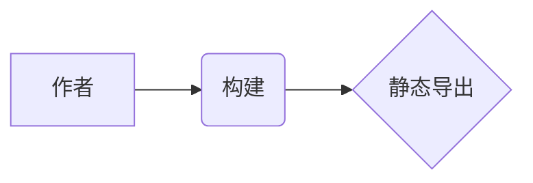

# 博客写作规范

这份文件回答一件事：**在这个博客里，一篇文章该怎么写。**

它放在仓库根目录（与 [README.md](./README.md)、[PROJECTS.md](./PROJECTS.md) 并列），**不是文章**，
不参与构建。文章一律写在 `content/<lang>/posts/` 下；那边的字段速查表在
[content/README.md](./content/README.md)，本文比它更全、更适合从头读一遍。

> 本文与代码一一对应。改行为请同步改本文，别让文档骗人。涉及的关键文件：
> `lib/content.ts`（读文件、slug、字数）、`lib/markdown.ts`（渲染管线）、
> `lib/typography.ts`（中文排版）、`lib/charts.ts`（图表语言名）、`lib/frontmatter.ts`（字段归一化）。

---

## 0. 三条铁律

1. **仓库里不放文章。** `content/**/posts/` 只保留规范与空目录结构，`README.md` 与下划线开头的
   文件都被加载器显式跳过。不写测试文章、不写示例文章 —— 第一篇由你亲笔写。
2. **URL 只能是 ASCII。** 文件名可以是中文，但上线地址（slug）只能是 `[A-Za-z0-9._~/-]`。
   文件名是中文时必须自己补一行 `slug`，否则构建**直接失败**（原因见第 2 节）。
3. **配色与实现不归文章管。** 文章只管文字与 Markdown；版式、颜色、交互都在代码里
   （颜色只有 `app/globals.css` 三套令牌一个落点）。文章里要用的「花样」只有本文列出的这些。

---

## 1. 目录、文件与地址

```
content/
├─ README.md                     ← 字段速查，不参与构建
├─ zh/
│  └─ posts/
│     ├─ README.md               ← 中文写作提示，不参与构建
│     ├─ _index.md               ← 可选：中文帖子的顶层卡组元数据
│     ├─ hello-world.md          → /zh/posts/hello-world/
│     ├─ notes/                  ← 目录即分组（卡组）
│     │  ├─ _index.md            ← 该卡组的标题 / 描述 / 顺序 / 封面
│     │  └─ first-note.md        → /zh/posts/notes/first-note/
│     └─ notes/index.md          → /zh/posts/notes/（目录首页，可选）
└─ en/
   └─ posts/…                    ← 同上，英文
```

规则：

| 事项 | 约定 |
| --- | --- |
| 只认的后缀 | `.md`、`.markdown` |
| slug 怎么来 | 由文件路径推导：`notes/first-note.md` → `notes/first-note` |
| `目录/index.md` | 代表这个目录本身，slug 就是目录名（`notes/index.md` → `notes`） |
| 自定义 slug | frontmatter 里写 `slug`（别名 `permalink`），**只能 ASCII** |
| 跳过的文件 | 名字叫 `README.md` 的；下划线开头的（`_index.md` 是唯一的例外，它是卡组元数据） |
| slug 冲突 | 两个文件推出同一个 slug → **直接报错**，不会悄悄覆盖 |
| 零文章 | 正常状态，站点照样能构建、能浏览（各页有空状态） |

**为什么 ASCII 是硬要求（真踩过的坑）**：浏览器会把 `href` 里的中文自动百分号编码，
而静态导出会把中文 slug 写成百分号编码的目录名，Cloudflare 查文件前又解码一次 ——
两边永远对不上。表现是「列表里有卡片，点标题进去 404」。所以加载器直接拦住非 ASCII：

```
content/zh/posts/notes/笔记.md：slug "笔记" 里有 URL 不安全的字符（中文、空格、% 等）。
… 把文件重命名为 ASCII（例如 note-1.md），或在 frontmatter 里补一行 slug = "note-1"（YAML: slug: note-1）。
```

**两种解法**（任选）：

```markdown
---
title: 笔记
slug: note-1        # ← 保留中文文件名，只补这一行
date: 2026-10-01
---
```

或直接把文件重命名成 `note-1.md`。

---

## 2. 一篇最小文章

````markdown
---
title: 你好，世界
date: 2026-01-01
tags: [随笔]
---

正文从这里开始。

## 小节标题

一段话。
````

frontmatter 是**文件开头的元数据块**：第一行写 `---` 就用 YAML，写 `+++` 就用 TOML，
两者**完全等价**，挑顺手的一种，同一个文件里不要混用。

### YAML（`---`）

```yaml
---
title: 用 YAML 写的文章
date: 2026-01-01 09:30:00
updated: 2026-01-03
description: 一句话摘要，会用在列表、SEO、RSS 里。
tags: [写作, 折腾]
categories: [随笔]
cover: /thumbnails/zh/yaml-post.png
pinned: false
draft: false
isAI: false
slug: yaml-post          # 文件名是中文时才必须
references:
  - id: 1
    title: 一篇参考资料
    url: https://example.com/paper
    author: 张三
---
```

### TOML（`+++`）

```toml
+++
title = "用 TOML 写的文章"
date = 2026-01-01T09:30:00
updated = 2026-01-03
description = "一句话摘要，会用在列表、SEO、RSS 里。"
tags = ["写作", "折腾"]
categories = ["随笔"]
cover = "/thumbnails/zh/toml-post.png"
pinned = false
draft = false
isAI = false
slug = "toml-post"

[[references]]
id = 1
title = "一篇参考资料"
url = "https://example.com/paper"
author = "张三"
+++
```

> `date` 不写引号时：TOML 按日期时间解析、YAML 按时间对象解析，本仓库统一归一化成字符串，
> 两种写法最终语义一致，不必纠结。**字符串值一定要加引号**，忘了会报
> `无法解析的值 "…"（字符串请加引号）`。

---

## 3. frontmatter 字段全集

用不到的字段直接省略。**建议只写 `title` / `date` / `description` / `tags` 这四样起手**。

| 字段 | 类型 | 说明 |
| --- | --- | --- |
| `title` | 字符串 | **建议必写**。缺省时依次回退到正文第一个 `#` 标题、文件名。 |
| `date` | 日期 | 发布日期。缺省回退到**文件修改时间**，建议显式写。 |
| `updated` | 日期 | 最后更新日期，文章页会显示「改于 …」。 |
| `description` | 字符串 | 摘要，用于列表 / SEO / RSS。缺省时从正文自动截取约 **160 字**。 |
| `tags` | 数组或字符串 | `[a, b]` 或 `"a, b"`（逗号、顿号、分号、竖线都能分隔），自动去重。 |
| `categories` | 数组或字符串 | 同上。 |
| `cover` | 字符串 | 缩略图，见第 11 节。纯文字站可以完全不写。 |
| `pinned` | 布尔 | 置顶，首页列表排在前面（不影响卡组内顺序）。 |
| `draft` | 布尔 | 草稿。**生产构建里不出现**，`npm run dev` 下能看到并带草稿徽章。 |
| `about` | 布尔 | 标记为「关于」类文章；每种语言取时间最新的一篇，显示在 `/zh/about/`。 |
| `hiddenInHomeList` | 布尔 | 首页列表里不出现，但归档 / 标签 / 搜索里仍然有。 |
| `isAI` | 布尔 | AI 生成标记（带 `ai` 徽章，列表页默认可筛掉）。 |
| `comments` | 布尔 | 这一篇要不要评论区，缺省 `true`。写 `false` 就整篇不出评论区。 |
| `references` | 表数组 / 数组 | 参考文献，见第 10 节。 |
| `slug` / `permalink` | 字符串 | 自定义路由，**只能 ASCII**。 |
| `typography` | 布尔 / 对象 | 中文排版开关，见第 8 节。 |
| `order` / `weight` / `index` | 数字 | **只在 `_index.md` 里用**：卡组排序，小的在前。 |

### 别名与容错

以下写法都能识别，**选一种统一用**即可：

- 布尔值：`true` / `"true"` / `1` / `"是"` / `"开"`（反面：`false` / `"false"` / `0` / `"否"` / `"关"`）；
- 字段别名：
  `name`↔`title`、`created`/`published`↔`date`、`modified`↔`updated`、`summary`↔`description`、
  `cates`↔`categories`、`top`/`sticky`/`featured`↔`pinned`、
  `hidden`/`excludeFromHome`↔`hiddenInHomeList`、`ai`↔`isAI`、`comment`↔`comments`、
  `thumbnail`/`image`/`banner`↔`cover`、`permalink`↔`slug`。

### 日期口径

| 写法 | 解释 |
| --- | --- |
| `2026-01-01T09:30:00Z` / `+08:00` | 带时区，按绝对时间 |
| `2026-01-01T09:30:00` / `2026-01-01 09:30` | 不带时区，按**构建机器的本地时间** |
| `2026-01-01` | 只有日期，视为当天 `00:00:00Z`（跨时区最稳） |

只写日期最省心；要精确到分钟且在意跨时区，就带上时区。

### 字数与阅读时长怎么算

- 中、日、韩文按**字**计，西文按**词**计（`wordCount`）；
- 阅读时长 = 字数 ÷ **400 字/分钟**，向上取整，显示在文章页头。

---

## 4. 卡组：目录即分组

一个目录就是一个**卡组**。列表页按卡组分块显示（组头 + 篇数 + 组内卡片），
每个卡组还**自带一个页面**：`content/zh/posts/notes/` → `/zh/posts/notes/`，
不需要你写任何文件。

想让卡组有名字 / 说明 / 封面 / 排序，就在目录里放一个 `_index.md`：

```toml
+++
title = "折腾笔记"
description = "环境配置、踩坑记录之类。"
order = 10
cover = "/thumbnails/zh/notes.png"
+++
```

- `order` 小的排前面（`weight`、`index` 是别名），不写按 0 处理；
- `cover` 缺省时，卡组封面取组内第一篇文章的封面；
- 没有 `_index.md` 的目录只要有文章，照样被当成卡组，标题由 UI 用目录名兜底；
- 组内文章按**时间倒序**，`pinned` 不影响组内顺序；
- 目录里一篇文章都没有时，卡组页不存在（空目录不出现）。

两种**不做**卡组页的情形（「谁更具体谁优先」）：

1. 目录里写了 `index.md`（如 `notes/index.md` → slug `notes`）—— 那个地址就是你那篇文章，正文优先；
2. 顶层直接放的文章（`content/zh/posts/*.md`）不是卡组，在列表页里归「未分组」。

---

## 5. 正文怎么写（Markdown）

渲染管线是 `remark-parse` → GFM → 中文修正 → … → `rehype-highlight` → HTML，
构建期一次性跑完，静态导出后**没有 JS 也能读**。支持的东西：

| 想要什么 | 怎么写 | 备注 |
| --- | --- | --- |
| 表格 | GFM 表格 | `\|` 分隔，第二行写 `---` |
| 任务列表 | `- [ ]` / `- [x]` | GFM |
| 脚注 | `文字[^1]` + 文末 `[^1]: 说明` | GFM |
| 删除线 | `~~删除~~` | **单个 `~` 也认**（`singleTilde: true`） |
| 裸链接 | 直接写 `https://…` | 自动变成链接 |
| 表格/链接/图片 | 标准 Markdown | 图片见第 11 节 |
| 行内 HTML | 直接写 `<span>`、`<details>` 等 | 允许，但不参与中文排版优化 |
| 公式 | `$…$` / `$$…$$` | 见第 9 节 |

### 换行：单个换行就是换行

`remark-breaks` 已开启 —— **敲一个回车就换行**，不必在行尾留两个空格。
写中文随笔时这一点很顺手：

```markdown
第一行
第二行        ← 渲染出来就是两行
```

### 标题与目录

- 标题用 `#` ~ `######`，**渲染时自动加 id**（`rehype-slug`）并在末尾追加一个 `#` 锚点；
- 文章页左上角的**目录挂件**收集的是**全部标题**，但**只列出到 `####`（h4）**：
  `#####` / `#####` 更深的标题会渲染在正文里，但不会出现在目录里（缩进到第 3 档就没法再区分了）；
- 目录的层级只用于缩进（h1/h2 不缩进、h3 缩进一档、h4 缩进两档），**不做折叠**；
- 目录是**真锚点**，没有 JS 也能跳转（只是不会高亮当前小节）；
- 正文宽度、字号、行距由**读者的本机阅读偏好**决定（设置中心三档），你写的时候不用管宽度。

### 几个容易踩的语法坑

- **有序列表的标记后面必须有空格**：`1. 世界边界检查` 是一个列表项；
  `1.世界边界检查` 只是以「1.」开头的普通段落 —— 这是 Markdown 语法本身的要求（GitHub 上也一样），
  编号后面紧跟中文时最容易漏。**排版优化不会替你补这个空格。**
- 中文里紧贴标点的强调 / 删除线（`**抗生素（antibiotic）**的定义`、`~~（已废弃）~~`）
  由 `remark-cjk-friendly` 系列插件修正，**可以放心写**；
  但**跨节点的相邻**（如 `**中文**English`）插件看不出来，这种地方自己补一个空格。
- 代码块**要写语言名才会高亮**（`detect: false`，不做自动语言猜测）；
  不写语言名的围栏代码块不会高亮，也不会有配色。

---

## 6. 代码块与五类图表

约定：**用代码块的语言名**决定画什么。语言名写在开头的三个反引号后面。

| 语言名 | 渲染成 | 注意 |
| --- | --- | --- |
| `mermaid` | Mermaid：流程图 / 时序图 / 状态图 / 类图 / 甘特图 | 可写中文注释 |
| `echarts` | ECharts 图表，内容是**一份 option 的 JSON** | **是 JSON，不能写注释** |
| `graphviz` / `dot` | Graphviz：有向图 / 无向图 | 可写中文注释 |
| `abc` / `abcjs` | 五线谱（ABC 记谱） | 可写中文注释 |
| `smiles` | 化学结构式（SmilesDrawer） | 只取**第一行**表达式；`#` 开头的行忽略 |

其余语言名一律走普通代码高亮（**monokai** 主题，比如 `ts`、`python`、`bash`、`json`、`yaml`）。

````markdown

````

图表的注意点：

- **加标题**：写在语言名后面 `title="…"`（单双引号、不带引号都认）；
  也能用 `~~~` 围栏；
- **在浏览器里画**：五个库都按需动态加载（静态导出没法预渲染），所以插图表不拖慢首屏，
  但也没有「无 JS 也能看」的降级 —— 图表位置是空的；
- **画失败不炸站**：语法错 / JSON 不合法 / SMILES 解析不了时，会在原位显示红色报错并打印到控制台，
  构建不会失败；
- 图表里的颜色走站点令牌（暗色下自动换），**不要在 ECharts / Graphviz 里写死颜色**（暗色会看不见）。

---

## 7. 公式（KaTeX）

- 行内公式 `$…$`，独立公式 `$$…$$`；
- 支持 **mhchem** 扩展：`\ce{H2O}`、`\pu{1 mol}`；
- **公式写错不会弄挂整站**：渲染器会把它按 `errorColor`（红）画在原位，并在构建日志里给一条警告。

### 站点自定义宏（写在正文里直接可用）

| 宏 | 效果 |
| --- | --- |
| `\RR` `\NN` `\ZZ` `\QQ` `\CC` | 黑板体 ℝ / ℕ / ℤ / ℚ / ℂ |
| `\dd` `\dif` | 正体微分号 d |
| `\ee` `\ii` | 正体 e / i |
| `\abs{x}` `\norm{x}` `\ket{\psi}` `\bra{\phi}` | 绝对值 / 范数 / 右矢 / 左矢 |
| `\E` `\Var` `\Cov` | 期望 / 方差 / 协方差 |
| `\argmax` `\argmin` | 带下标的 arg max / arg min |
| `\ce{…}` `\pu{…}` | 化学式与单位（mhchem） |

宏名统一是「反斜杠 + 2~3 个字母」，不会和 KaTeX 内置命令撞车。

---

## 8. 中文排版自动优化

写中文时**不用**在半角/全角之间纠结，也不用自己敲中英文之间的空格 —— 渲染期会收拾干净
（实现在 `lib/typography.ts`，**只改正文文本**，不碰代码与公式）。

| 规则 | 例子 |
| --- | --- |
| 中文与半角字母数字之间补一个空格 | `中文English` → `中文 English`；`2024年` → `2024 年` |
| 前一个字符是中文时，半角标点转全角 | `他说,好` → `他说，好`；`中文.` → `中文。` |
| 中文语境里手打的 `...` 转 `……` | `原来如此...` → `原来如此……` |
| 成对的半角括号只要有一侧贴着中文，两边一起转全角 | `中文(test)` → `中文（test）`；但 `f(x)` 不动 |

**不会**被动到的东西：

- 代码块、行内代码、公式（`$…$` / `$$…$$`）里的内容原样保留；
- 链接与图片的**地址**（链接文字会被排版，地址不会）；
- 内联 HTML 里的内容；
- `1,000`、`3.14`、`v1.2.3`、`example.com`、`a.ts` 这类数字 / 英文内部的标点
  （规则只认「前一个字符是中文」）；
- 引号：半角 `"` `'` 一律不转，中文引号请直接写 `“ ”`。

三点要知道：

1. 已经自己敲了空格的地方**不会重复加空格**，你想怎么排就怎么排；
2. **跨节点的相邻**（如 `**中文**English`）看不出来，自己补一个空格；
3. **有序列表标记后的空格**不会被补（见第 5 节的坑）。

### 单篇关掉排版优化

```toml
+++
title = "这篇不自动排版"
typography = false          # 整块关掉
# 或者只关某几条：
# typography = { spacing = false, punctuation = false, parentheses = false }
+++
```

写得认不出来（比如笔误写成 `typo = false`）就当没写，四条规则照旧全开。
`...`→`……` 这条跟着「标点」那条一起开关。

---

## 9. 参考文献

frontmatter 里写 `references`，正文里用 `[reference:1]` 这样的角标引用。

```toml
+++
# …其它字段…

[[references]]
id = 1
title = "Attention Is All You Need"
url = "https://arxiv.org/abs/1706.03762"
author = "Vaswani et al."
site = "arXiv"
date = "2017-06-12"
note = "可选的一句话备注"
+++
```

正文里：

```markdown
注意力机制[reference:1]的关键是……
```

规则：

- `id` 缺省时按书写顺序 1、2、3…；
- `title` / `url` 至少写一个；文末参考列表按 id 排序；
- 也接受极简写法：`references = ["https://a.com", "https://b.com"]`；
- **角标写法必须紧贴**：`[reference:1]`，中间不能有空格；
- 同一篇里可以重复引用同一条；
- 排序：纯数字 `id` 按数值升序在前，其余（如 `note`）按书写顺序在后；
  **角标里显示的数字 = 它在文末列表里的序号**，两边永远一致；
- 引用了不存在的 id（例如笔误 `[reference:404]`）会**渲染成红色提示**并在构建日志里给一条警告，
  **不会让构建失败** —— 方便你先写完正文再补 frontmatter；
- 文末参考列表会出现在正文之后、「上下篇」之前（与正文同一套度量）；
- 文末列表里，被引用过的条目带一个 `↩` 返回箭头，可以跳回引用处。

**不要在链接文字里写角标**（会出现 `<a>` 套 `<a>`，渲染器会跳过）。

---

## 10. 标题、摘要与列表页的关系

- `description` 会出现在列表卡片、SEO `<meta>`、RSS 里；不写就从正文自动截取约 160 字。
  想要列表页好看，**建议手写一句摘要**。
- `title` 不写会依次回退到「正文第一个 `#` 标题」→「文件名」，但**建议显式写**。
- `tags` / `categories` 会在文章页渲染成可点的片（点进去是列表页的筛选视图）。
- `draft: true` 的文章在生产构建里**根本不存在**（不是显示成灰色，是整个不生成）。
- `about: true` 让这一篇成为 `/zh/about/` 页的内容（每语言取时间最新的一篇）。
- `isAI: true` 会在文章页与卡片上带 `ai` 徽章；列表页默认可以筛掉。

---

## 11. 图片与缩略图

**这是一个纯文字站：卡片上没有图片位，不写封面完全正常。** 封面按下面顺序找，找到就用：

1. frontmatter 的 `cover`（`thumbnail`、`image`、`banner` 是别名）；
   写 `https://…` 当外链，写 `/xxx.png` 或 `xxx.png` 都当作 `public/` 下的路径；
2. `public/thumbnails/<lang>/<slug>.png`（也认 `.jpg` `.jpeg` `.webp` `.avif` `.svg`）；
   再退 `public/thumbnails/<slug>.png`，再退 `public/covers/…` 的同样两种层级；
   嵌套 slug 会先试完整路径（`notes/first-note`），再试最后一段（`first-note`）；
3. 正文里第一张图片；
4. 都没有 → 没有封面，卡片走无图样式。

正文里的图片用标准 Markdown：``（放 `public/images/` 之类）。

---

## 12. 发布后长什么样（阅读页的固定行为）

这些是**页面自带的交互**，你写文章时只需要知道「读者会看到什么」，不用做任何配置：

- **顶栏在阅读时自动收起**：往下滚过一小段（约 120px）后顶栏上滑隐藏，
  把视野让给正文；回到页面顶部自动恢复。
- **双击唤回顶栏**：鼠标双击（或触屏双轻触）任意位置，可以把顶栏请出来、再双击收回。
  这是阅读页独有的行为，不影响首页、列表页。
- **左上角目录挂件**：贴顶栏下沿的一颗方形按钮（与参考站 wunai-blog 同一位置）；
  点开是从它下面弹出的面板（面板自己滚，底部附一份「上下篇」），点一条目录就顺势收起。
  顶栏收起时，挂件会跟着上移补位，贴到视口顶。
- **粘性标题**：大标题滚出视野后，顶栏下面挂一条紧凑的同名标题（左边一个「正文」小字），
  长标题一行到底、尾巴省略号。
- **右侧阅读进度**：一条线 + 一个**可拖的滑块**（也能用方向键：`↑`/`↓` 一步、
  `PageUp`/`PageDown` 三步、`Home`/`End` 两头）。
- **右下角回顶**：滚过约 600px 后出现，按钮里有一圈跟进度同步的短线。
- **评论区**：滑到评论区才加载 giscus 的 iframe（不读评论就不会连过去）；
  想关掉某一篇，写 `comments: false`。
- **打印（Ctrl+P）**：目录与它的开关、粘性标题、进度线、回顶、评论区**都不印**，
  正文与文末「上下篇」照印 —— 打印出来就是一份排版好的 PDF。

---

## 13. 常见报错

| 报错 | 原因 / 怎么办 |
| --- | --- |
| `frontmatter 没有闭合` | 开头写了 `---`（或 `+++`），结尾漏了同样的分隔行 |
| `slug "…" 里有 URL 不安全的字符` | 文件名（或 frontmatter 的 slug）是中文 / 带空格 / 带 `%`。改成 ASCII，或补一行 `slug` |
| `TOML frontmatter 解析失败：…（第 N 行）` | TOML 语法问题，行号已换算成文件行号 |
| `键 "x" 重复定义` | 同一个键写了两次 |
| `slug 冲突` | 两个文件推出同一个 slug，用 `slug` 字段区分 |
| `无法解析的值 "…"（字符串请加引号）` | TOML 里的字符串忘了加引号 |
| 构建日志里 `正文里的 [reference:N] 在 frontmatter 的 references 里找不到对应 id` | 角标笔误或漏写参考文献（**不致命**，正文里显示红色提示） |
| 构建日志里 `references 里 id "x" 出现了多次` | 参考文献 id 重复，角标统一指向第一条 |
| 构建日志里 `katex：第 N 行：…` | 公式没渲染成功，按红色错误画在原位，改公式即可 |

构建期报错都会带上源文件路径与行号，按提示改。

---

## 14. 写完一篇文章的检查清单

- [ ] 文件在 `content/<lang>/posts/` 下，后缀 `.md` / `.markdown`；
- [ ] 文件名是中文 / 含空格的话，frontmatter 里补了 **ASCII 的 `slug`**；
- [ ] frontmatter 首尾分隔行配对（`---` 对 `---`，或 `+++` 对 `+++`）；
- [ ] 有 `title` 与 `date`，并手写了一句 `description`；
- [ ] `tags` / `categories` 里没有多余空格、没有重复；
- [ ] 正文用了 `##` 起的标题层级（一篇文章只有一个 `#`，通常就是标题本身）；
- [ ] 有序列表的「编号」与中文之间有空格；
- [ ] 代码块都写了语言名；图表块的语言名是第 6 节那五个之一；
- [ ] 引用了 `[reference:N]` 的话，frontmatter 里有对应 `id`；
- [ ] 草稿阶段用 `draft: true`（`npm run dev` 里预览，生产构建不含它）；
- [ ] 改完跑一次 `npm run typecheck`；要发布再 `npm run build`。

---

## 15. 与其它文档的分工

| 想知道什么 | 看哪里 |
| --- | --- |
| 一篇文章怎么写（本文） | `博客写作规范.md` |
| frontmatter 字段速查 | `content/README.md` |
| 站点是什么、怎么跑、怎么部署 | `README.md` |
| 每一项功能为什么这样做、踩过哪些坑、还没在真机验证过什么 | `PROJECTS.md` |
| 代码里「别在这里写死什么」 | 各 `lib/*.ts` 文件头的注释 |

**改行为就改文档**：本文与代码一一对应，动了加载器 / 渲染器的行为，
请把对应小节一起改掉。